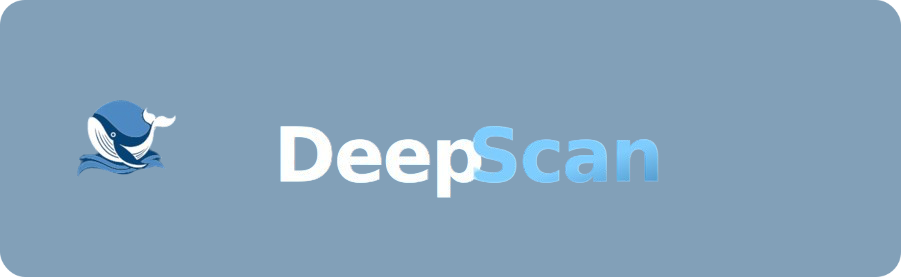
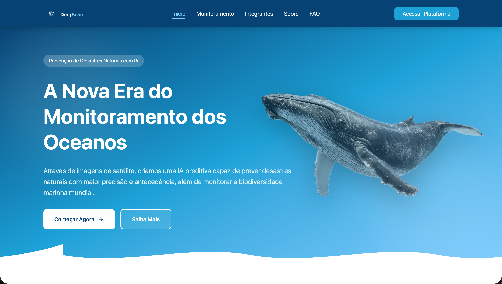
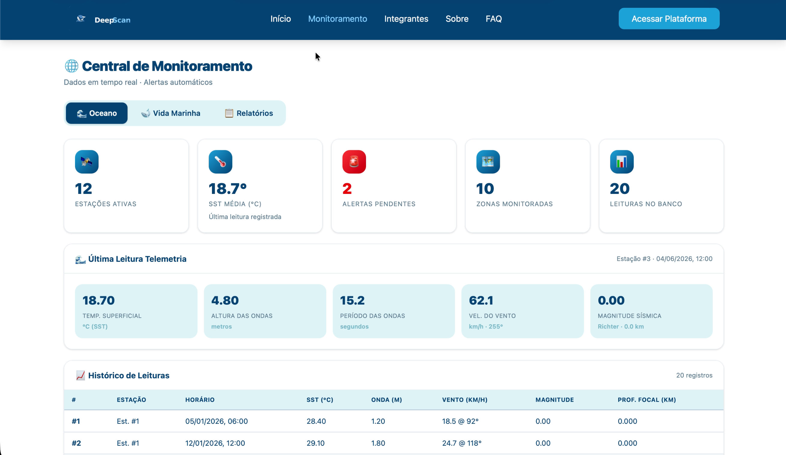
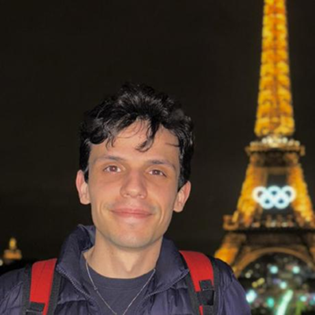

<div align="center">



# DeepScan — Plataforma de Monitoramento Oceânico

**Inteligência oceânica em tempo real via satélite, com IA preditiva para prevenção de desastres naturais.**

[](https://react.dev)
[](https://www.typescriptlang.org)
[](https://vite.dev)
[](https://tailwindcss.com)
[](https://deepscanfiap.vercel.app)

[🌐 Link da aplicação](https://deepscanfiap.vercel.app) · [📁 Repositório](https://github.com/deep-scan-fiap) · [📧 Contato](mailto:deepscan.fiap@gmail.com)

</div>

---

## 📋 Sumário

- [Sobre o Projeto](#-sobre-o-projeto)
- [Demonstração](#-demonstração)
- [Tecnologias Utilizadas](#-tecnologias-utilizadas)
- [Arquitetura do Sistema](#-arquitetura-do-sistema)
- [Estrutura de Pastas](#-estrutura-de-pastas)
- [Como Usar](#-como-usar)
- [Variáveis de Ambiente](#-variáveis-de-ambiente)
- [Equipe](#-equipe)
- [Contato](#-contato)

---

## 🌊 Sobre o Projeto

O **DeepScan** é uma plataforma full-stack de monitoramento oceânico que integra dados de **boias oceânicas**, **satélites** e **estações submarinas** para monitorar, analisar e alertar sobre eventos nos oceanos em tempo real.

### 🎯 Problema que Resolve

Desastres naturais oceânicos como tsunamis, furacões e anomalias de temperatura causam impactos devastadores e frequentemente são detectados tarde demais. O DeepScan centraliza dados de múltiplas fontes em um único painel inteligente, permitindo resposta antecipada.

### ✨ Funcionalidades

| Funcionalidade                                                   |
| ---------------------------------------------------------------- |
| 🛰 Monitoramento de estações (boias, satélites, submarinas)      |
| 🌡 Telemetria oceânica em tempo real (SST, ondas, vento, sismo)  |
| 🚨 Sistema de alertas com gestão de risco (BAIXO / MÉDIO / ALTO) |
| 🐋 Monitoramento de biodiversidade marinha com status IUCN       |
| 🗺 Zonas oceânicas e vinculação de estações                      |
| 🤖 IA preditiva (tsunamis, furacões, anomalias)                  |
| 📊 Relatórios automáticos gerados por IA                         |

---

## 🎬 Demonstração

<div align="center">

### 🌐 Plataforma em produção

**[https://deepscanfiap.vercel.app](https://deepscanfiap.vercel.app)**

### 📺 Vídeo de Apresentação

<!-- ▶ Adicionar link do YouTube aqui -->

> 🔗 **[Assista no YouTube uma demonstração do projeto]**

</div>

---

## 🛠 Tecnologias Utilizadas

### Frontend

| Tecnologia                                   | Versão   | Finalidade               |
| -------------------------------------------- | -------- | ------------------------ |
| [React](https://react.dev)                   | 18.3.1   | Biblioteca de UI         |
| [TypeScript](https://www.typescriptlang.org) | 5.7.2    | Tipagem estática         |
| [Vite](https://vite.dev)                     | 6.4.3    | Build tool e dev server  |
| [Tailwind CSS](https://tailwindcss.com)      | 4.1.12   | Estilização utilitária   |
| [React Router](https://reactrouter.com)      | 7.13.0   | Roteamento SPA           |
| [Lucide React](https://lucide.dev)           | 0.487.0  | Ícones SVG               |
| [Radix UI](https://www.radix-ui.com)         | —        | Componentes acessíveis   |
| [shadcn/ui](https://ui.shadcn.com)           | —        | Design system            |
| [Recharts](https://recharts.org)             | 2.15.2   | Gráficos e visualizações |
| [Motion](https://motion.dev)                 | 12.23.24 | Animações                |

### Backend (repositório separado)

| Tecnologia      | Finalidade                                     |
| --------------- | ---------------------------------------------- |
| Java + Quarkus  | API REST principal · dados oceânicos e alertas |
| Oracle Database | Persistência de dados                          |

### DevOps & Infra

| Ferramenta | Uso                              |
| ---------- | -------------------------------- |
| Vercel     | Deploy e hospedagem do frontend  |
| GitHub     | Controle de versão e colaboração |

---

## 🏗 Arquitetura do Sistema

```
┌─────────────────────────────────────────────────────┐
│                   USUÁRIO / BROWSER                 │
└───────────────────────┬─────────────────────────────┘
                        │
┌───────────────────────▼─────────────────────────────┐
│             FRONTEND — React + TypeScript           │
│           Vercel · https://deepscanfiap.vercel.app  │
└──────┬────────────────────────────────────┬─────────┘
       │                                    │
┌──────▼──────────┐              ┌──────────▼──────────┐
│  Backend Java   │              │     Backend IA      │
│  Quarkus · REST │              │ IA · ML · Previsões │
└──────┬──────────┘              └─────────────────────┘
       │
┌──────▼──────────┐
│ Oracle Database │
│ Dados oceânicos │
└─────────────────┘
```

---

## 📁 Estrutura de Pastas

```
DeepScan-FrontEnd/
│
├── public/
│   ├── favicon.svg
│   └── icons.svg
│
├── src/
│   ├── api/                    # Módulos de integração com o backend
│   │   ├── config.ts           # URL base da API
│   │   ├── alertas.ts          # Endpoints de alertas
│   │   ├── avistamentos.ts     # Endpoints de avistamentos
│   │   ├── especies.ts         # Endpoints de espécies
│   │   ├── estacoes.ts         # Endpoints de estações
│   │   ├── leituras.ts         # Endpoints de telemetria
│   │   └── zonas.ts            # Endpoints de zonas
│   │
│   ├── assets/                 # Imagens e recursos estáticos
│   │   ├── logo.png            # Logotipo DeepScan
│   │   ├── whale.png           # Baleia (elemento visual principal)
│   │   ├── monitoramento.png   # Imagem da aba de monitoramento 
│   │   ├── paginaInicial.png   # Página inicial da aplicação
│   │   └── foto*.png/jpeg      # Fotos da equipe
│   │
│   ├── components/             # Componentes reutilizáveis
│   │   ├── Feedback.tsx        # LoadingSpinner, ErrorBox, EmptyBox
│   │   ├── Footer.tsx          # Rodapé global
│   │   ├── Header.tsx          # Cabeçalho e navegação
│   │   ├── Layout.tsx          # Wrapper de layout (Header + Outlet + Footer)
│   │   ├── ScrollToTop.tsx     # Scroll automático ao trocar de rota
│   │   └── ui/                 # Componentes ui
│   │
│   ├── hooks/                  # Custom hooks
│   │   ├── useFetch.ts         # Hook genérico de fetch com loading/error
│   │   └── use-mobile.ts       # Detecção de viewport mobile
│   │
│   ├── lib/
│   │   └── utils.ts            # Funções utilitárias (cn, etc.)
│   │
│   ├── pages/                  # Páginas da aplicação
│   │   ├── Home.tsx            # Landing page
│   │   ├── Monitoramento.tsx   # Painel principal (dados ao vivo)
│   │   ├── Sobre.tsx           # Sobre o projeto
│   │   ├── FAQ.tsx             # Perguntas frequentes
│   │   ├── Integrantes.tsx     # Equipe
│   │   ├── Login.tsx           # Acesso à plataforma
│   │   └── NotFound.tsx        # Página 404
│   │
│   ├── styles/
│   │   ├── theme.css           # CSS variables (paleta de cores)
│   │   ├── tailwind.css        # Configuração Tailwind v4
│   │   └── animations.css      # Animações customizadas
│   │
│   ├── types/
│   │   └── index.ts            # Tipos TypeScript das entidades do backend
│   │
│   ├── App.tsx                 # Root da aplicação
│   ├── main.tsx                # Entry point
│   ├── routes.tsx              # Definição de rotas
│   └── vite-env.d.ts           # Tipos do Vite
│
├── index.html
├── package.json
├── tsconfig.json
├── tsconfig.app.json
├── tsconfig.node.json
└── vite.config.ts
```

---

## 🖼 Imagens do Projeto

<div align="center">

|                                   Página inicial                                    |                                   Monitoramento                                    |
| :---------------------------------------------------------------------------------: | :--------------------------------------------------------------------------------: |
|  |  |
|                           Identidade visual da plataforma                           |                              Sistema em funcionamento                              |

</div>

---

## 🚀 Como Usar

### Pré-requisitos

- [Node.js](https://nodejs.org) 18+ instalado
- [npm](https://npmjs.com) ou [pnpm](https://pnpm.io)
- Backend Java Quarkus rodando em `localhost:8080` (para dados ao vivo)

### Instalação e execução local

```bash
# 1. Clone o repositório
git clone https://github.com/deep-scan-fiap/DeepScan-FrontEnd.git
cd DeepScan-FrontEnd

# 2. Instale as dependências
npm install

# 3. Inicie o servidor de desenvolvimento
npm run dev
```

A aplicação estará disponível em **http://localhost:5173**

### Build para produção

```bash
# Gera os arquivos otimizados em /dist
npm run build

# Pré-visualiza o build localmente
npm run preview
```

### Executando o backend Java (dados ao vivo)

```bash
# No repositório do backend
cd DeepScan-Backend-Java
mvn quarkus:dev
```

> O backend ficará disponível em `http://localhost:8080`. O Vite redireciona automaticamente `/api` para essa porta via proxy configurado no `vite.config.ts`.

---

## ⚙️ Variáveis de Ambiente

Crie um arquivo `.env` na raiz do projeto se precisar customizar a URL da API:

```env
# URL base do backend (padrão: usa o proxy do Vite em desenvolvimento)
VITE_API_URL=http://localhost:8080/deepscan
```

---

## 👥 Equipe

<div align="center">

### Desenvolvido por alunos da FIAP — Engenharia de IA · 2026

</div>

<table align="center">
  <tr>
    <td align="center">
      <a href="https://github.com/hgsouz">
        <br/>
        <b>Hugo Souza</b>
      </a><br/>
      <sub>Desenvolvedor Frontend</sub><br/>
      <sub>React · TypeScript · UI/UX</sub><br/><br/>
      <a href="https://github.com/hgsouz">
        
      </a>
      <a href="https://linkedin.com/in/hugo-souza-34482222a/">
        
      </a>
    </td>
    <td align="center">
      <a href="https://github.com/PompeuDev">
        <br/>
        <b>Lucas Pompeu</b>
      </a><br/>
      <sub>Desenvolvedor Java</sub><br/>
      <sub>Quarkus · API REST · Arquitetura</sub><br/><br/>
      <a href="https://github.com/PompeuDev">
        
      </a>
      <a href="https://linkedin.com/in/lucaspompeu/">
        
      </a>
    </td>
    <td align="center">
      <a href="https://github.com/Labs-LCS">
        <br/>
        <b>Lucas Campanhã</b>
      </a><br/>
      <sub>Desenvolvedor Python</sub><br/>
      <sub>APIs · Integração · Dados</sub><br/><br/>
      <a href="https://github.com/Labs-LCS">
        
      </a>
      <a href="https://linkedin.com/in/lucas-campanhã-342707193/">
        
      </a>
    </td>
  </tr>
  <tr>
    <td align="center">
      <a href="https://github.com/GustavoSouNascimento">
        <br/>
        <b>Gustavo Souza</b>
      </a><br/>
      <sub>Especialista em Banco de Dados</sub><br/>
      <sub>Oracle · SQL · Modelagem</sub><br/><br/>
      <a href="https://github.com/GustavoSouNascimento">
        
      </a>
      <a href="https://linkedin.com/in/gustavo-souza-nascimento-698a81305/">
        
      </a>
    </td>
    <td align="center">
      <a href="https://github.com/EnzoYukio">
        <br/>
        <b>Enzo Yukio</b>
      </a><br/>
      <sub>Especialista em IA</sub><br/>
      <sub>ML · Modelos Preditivos · IA</sub><br/><br/>
      <a href="https://github.com/EnzoYukio">
        
      </a>
      <a href="https://linkedin.com/in/enzooyadomari/">
        
      </a>
    </td>
    <td></td>
  </tr>
</table>

---

## 🔗 Links Importantes

| Recurso                   | Link                                                                   |
| ------------------------- | ---------------------------------------------------------------------- |
| 🌐 Plataforma em produção | [https://deepscanfiap.vercel.app](https://deepscanfiap.vercel.app)     |
| 📁 Organização no GitHub  | [https://github.com/deep-scan-fiap](https://github.com/deep-scan-fiap) |
| 📺 Vídeo no YouTube       | _(adicionar link)_                                                     |
| 📧 E-mail de contato      | [deepscan.fiap@gmail.com](mailto:deepscan.fiap@gmail.com)              |

---

## 📞 Contato

Dúvidas, sugestões ou parcerias? Entre em contato:

📧 **[deepscan.fiap@gmail.com](mailto:deepscan.fiap@gmail.com)**

---

<div align="center">

Desenvolvido com 🌊 pela equipe DeepScan

</div>
